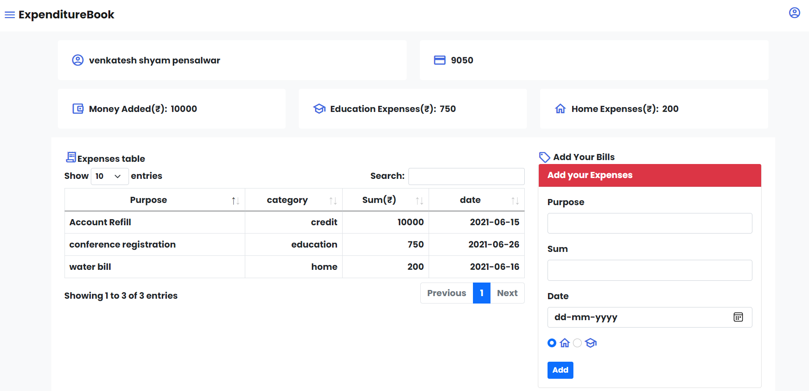
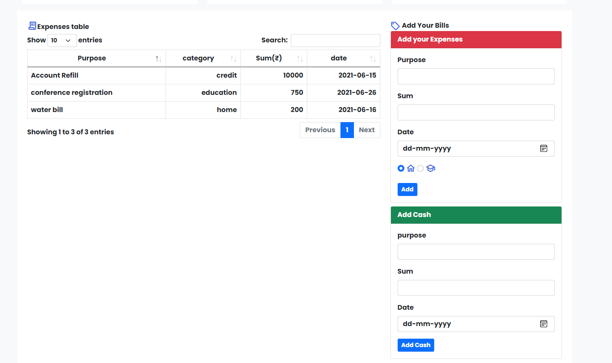

## Expenditure Book 

This application is Home finance web app that keep all your bills at one place.

you can add money in your account and add your expenditure bills so at end of the month you will get your all finance transaction at one place. i am using `flask` and `ajax` to run this web app and for backend i am using `MongoDB`

Behind the seen it using mongoDB aggregation for mathematics

