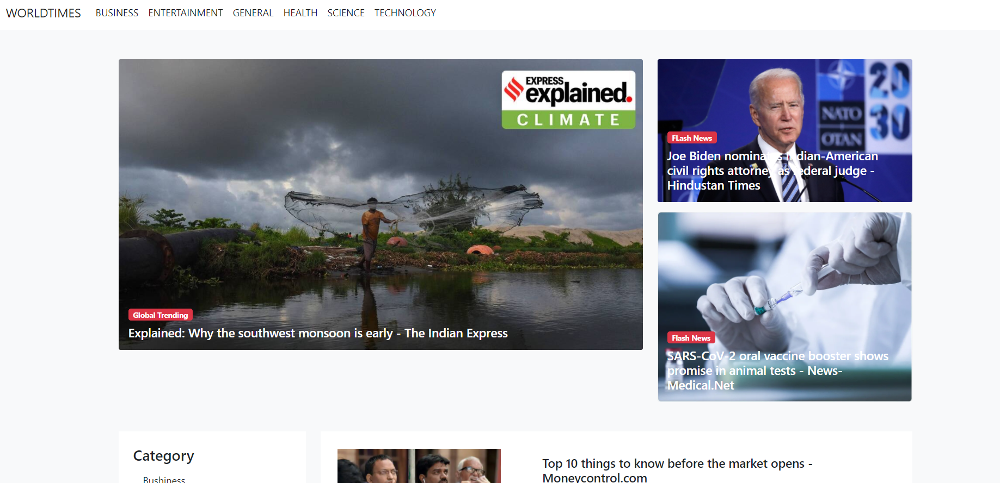
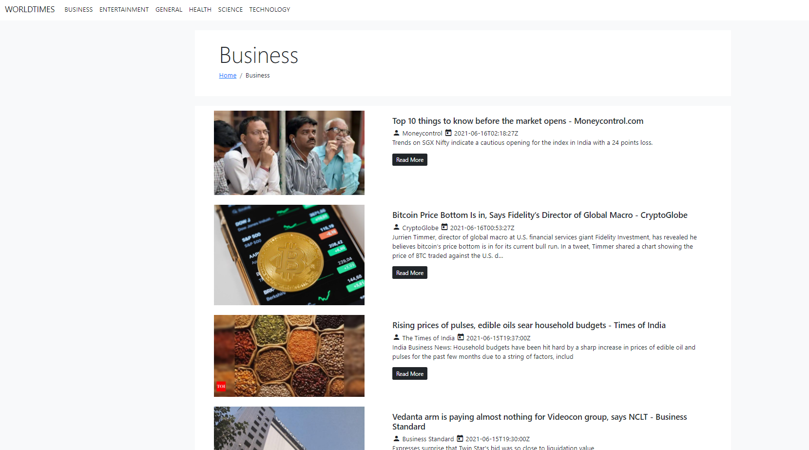
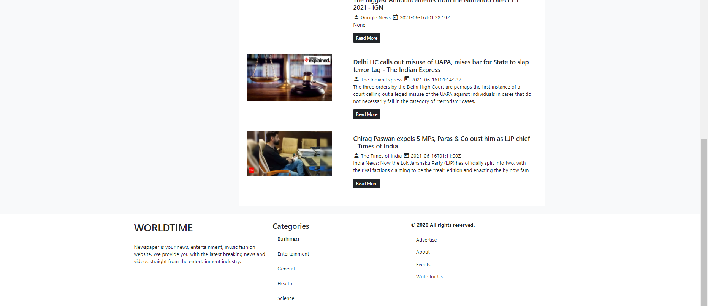

## WORLDTIMES News Portal

### To use this Project you Need Following

1. News API

|API Endpoint|Category|
|------------|--------|
|https://newsapi.org/v2/top-headlines|Top-News|
|https://newsapi.org/v2/top-headlines?category=business|Bussiness News|
|https://newsapi.org/v2/top-headlines?category=entertainment|Entertainment|
|https://newsapi.org/v2/top-headlines?category=general|Genral News|
|https://newsapi.org/v2/top-headlines?category=health|Health News|
|https://newsapi.org/v2/top-headlines?category=science|Science News
|https://newsapi.org/v2/top-headlines?category=technology|Technology News|

2. Accesses Key of this endpoints.

|Key|value|path|
|---|------|----|
|API_KEY|"Your API KEY"|`config.py`|

3. Options that i used to fetch news.

|options|Value|Description|
|-------|-----------|--------|
|`pageSize`|count of news|Get News in batch|
|`country`|country name in two letter format Ex. in,us| country wise news|
|`apikey`|api key| pass your api key|

## To Run this project

1. install flask.
2. set environment.
    1. Production
    2. development

   To set environment
   ```
   Windows
   set FLASK_ENV= Production or Development

   Linux
   export FLASK_ENV= Production or Development
   ```
3. run following command to start web application

```CMD
flask run
```

## Project Images


<hr>


<hr>


